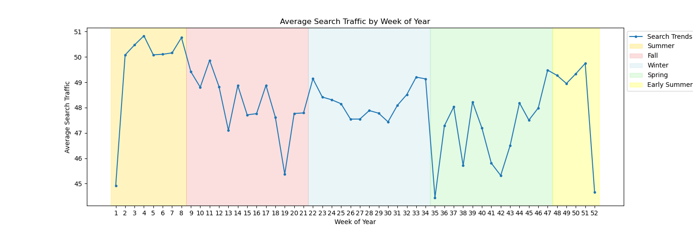

# prophet-challenge

## Description
In this project, I looked into whether there’s a connection between how often people search for MercadoLibre on Google and how its stock performs. 

I went through the search data and stock prices to see if any patterns stood out. The project included finding unusual spikes in search traffic, checking if there were any regular patterns over time, and using a tool called Prophet to predict future search trends. 

The goal was to see how understanding search traffic could help in making better stock trading decisions for MercadoLibre.

## Table of Contents
- [Usage](#usage)
- [Credits](#credits)
- [Screenshot](#screenshot)

## Usage
> **To use...**  
1. Clone the repository to your local system using `git clone`
2. Open the `forecasting_net_prophet.ipynb` file using Jupyter Labs
3. Then explore, transform, and analyze the data using the pandas library

## Credits
Starter code for this assignment was provided by [edX bootcamp](https://www.edx.org/boot-camps).

## Screenshot
>**Notebook Preview...**

  
 

